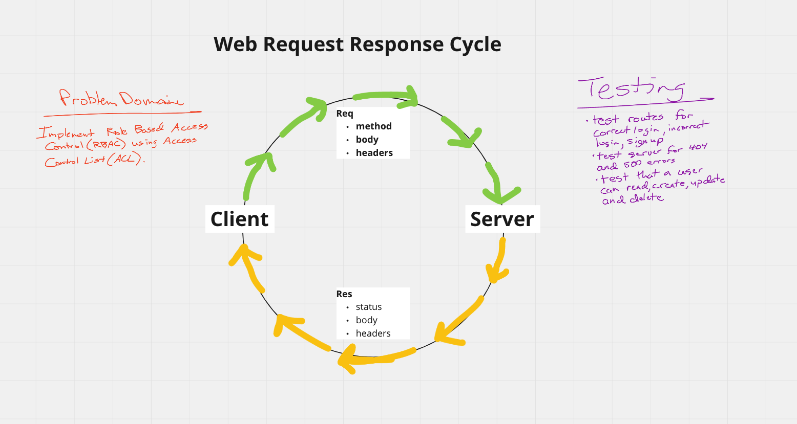

# LAB - Class 08 Auth-API

### Author: Dan Engel

### Links and Resources

- [ci/cd](https://github.com/daneng1/auth-api/actions)
- [back-end server url](https://danengel-auth-api.herokuapp.com/)

### Setup

#### Sign Up

1. Go to Swagger Inspector
1. Enter https://danengel-auth-api.herokuapp.com/signup as POST
1. In Body, enter { "username": "whatever", "password": "whatever"}
1. Click Send, this will create a new user. You should see the user object below.

#### Sign In

1. Go to Swagger Inspector
1. Enter https://danengel-auth-api.herokuapp.com/signin as POST
1. Click on Authentication and Headers and enter dan and dan for username and password
1. Click send and you will be logged in. You should see the user object including the token below.

#### `.env` requirements (when applicable)

- `PORT` - 3333

#### How to initialize/run your application (where applicable)

- npm run start

#### Tests

- 404 on a bad route
- 404 on a bad method
- The correct status codes and returned data for each REST route
  - Create a record using POST
  - Read a list of records using GET
  - Read a record using GET
  - Update a record using PUT
  - Destroy a record using DELETE

#### UML / Application Wiring Diagram

